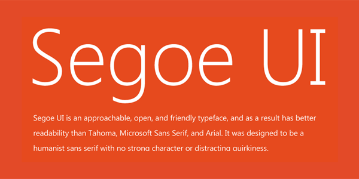

# Segoe-UI Font on Linux (Ubuntu)

installs the entire font family including emoji, also installs to wine-prefix if found.

## TL;DR

<p align="center"></div></p>

**Segoe** ***(/ˈsiːɡoʊ/ SEE-goh)*** is a typeface, or family of fonts, that is best known for its use by Microsoft. The company uses Segoe in its online and printed marketing materials, including recent logos for a number of products. Additionally, the Segoe UI font sub-family is used by numerous Microsoft applications.

**Segoe UI** is a member of the Segoe family used in Microsoft products for user interface text, as well as for some online user assistance material, intended to improve the consistency in how users see all text across all languages

## How to install it

Open `terminal` and run the command below

```
git clone https://github.com/mrbvrz/segoe-ui-linux
cd segoe-ui-linux
chmod +x install.sh
./install.sh
```

optional: you can run `sudo ./install.sh` for system installation

## Sample:

Github with Segoe UI font looks better (in the example below displays the [papirus-icon](https://github.com/PapirusDevelopmentTeam/papirus-icon-theme) repo)

|   Images (Screenshot)      | Description |
|:----:  | :----:  |
| <p align="center"></div></p>     |  Without Segoe-UI (before installing)   |
| <p align="center"></div></p>   |  With Segoe-UI (after installing)    |

[Source](https://en.wikipedia.org/wiki/Segoe)

Thanks to [SpudGunMan](https://github.com/SpudGunMan) for the update on adding new fonts, changed directory, and add wine-prefix.
